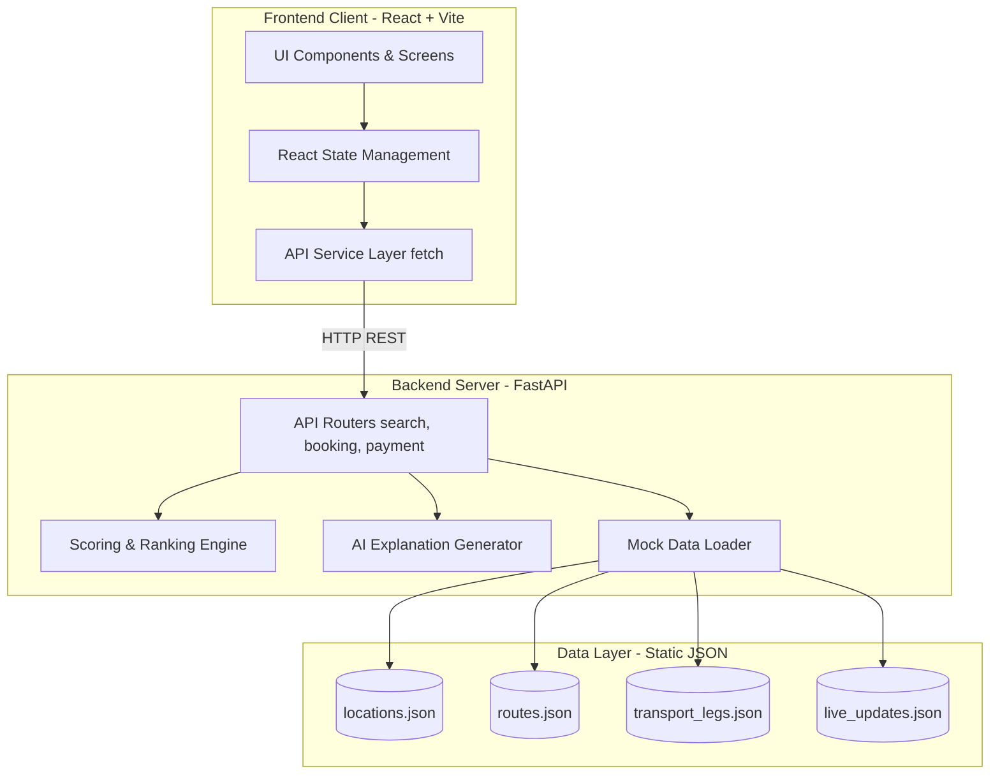

# RideFlow Architecture

## System Diagram

The architecture follows a classic Client-Server decouple, utilizing static JSON as a Mock Data Layer for the MVP.

## Component Breakdown

### 1. Frontend (Client)
- **Vite + React:** Provides an ultra-fast local development environment and reactive UI.
- **App Shell & Styling:** Vanilla CSS wrapped around a mobile-first `app-shell` frame, enhanced with inline styles and flexbox to simulate a native app environment on any screen size.
- **API Service (`api.js`):** Abstracts all `fetch` calls into simple async functions.

### 2. Backend (Server)
- **FastAPI:** High-performance async Python web framework.
- **Routers:** Segmented into logical domains (`search.py`, `booking.py`, `payment.py`, `journey.py`).
- **Scoring Engine (`scoring.py`):** Calculates normalized scores across multiple variables (Time, Fare, Walking, Transfers, Safety, Carbon, Reliability) by dynamically applying weights based on the user's selected preference profile.
- **Data Loader (`mock_data_loader.py`):** Caches the JSON mock database in memory on server startup for instantaneous O(1) reads.

### 3. Data Layer (JSON)
- Serves as the MVP database, storing predefined source-destination routes and atomic transportation legs to build out the multi-modal paths.
