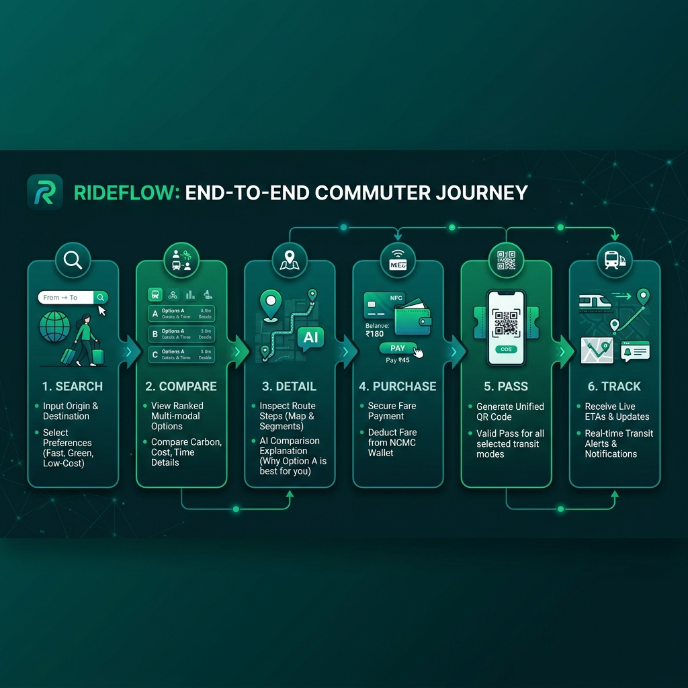
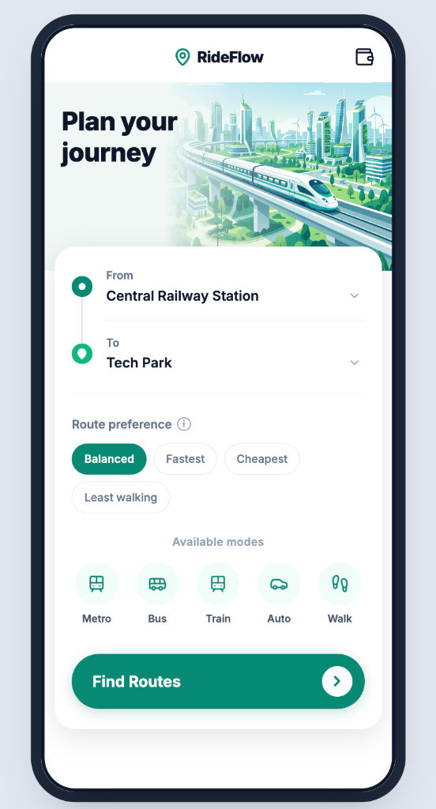
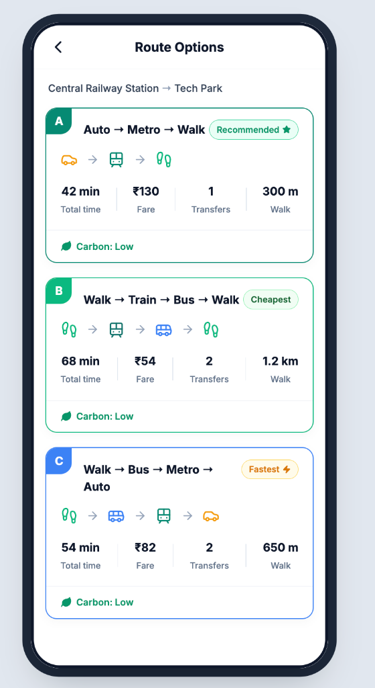
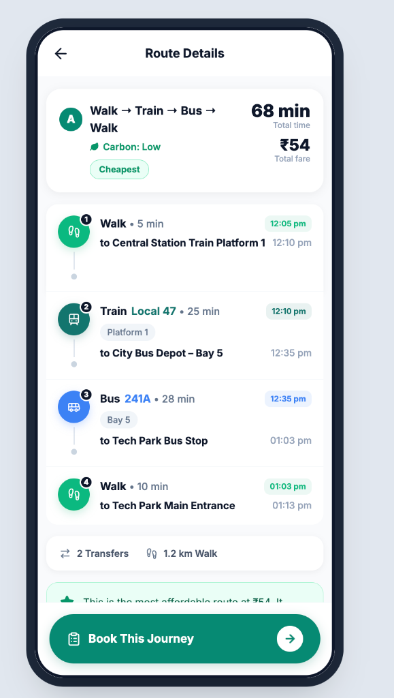
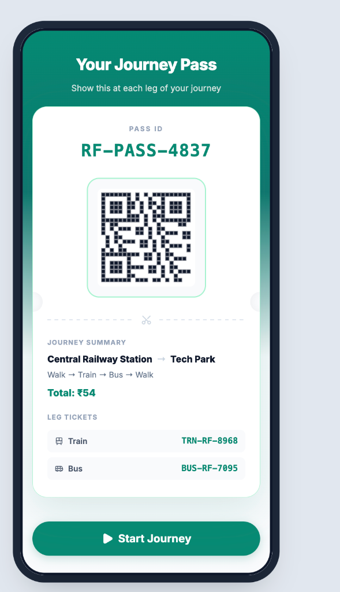
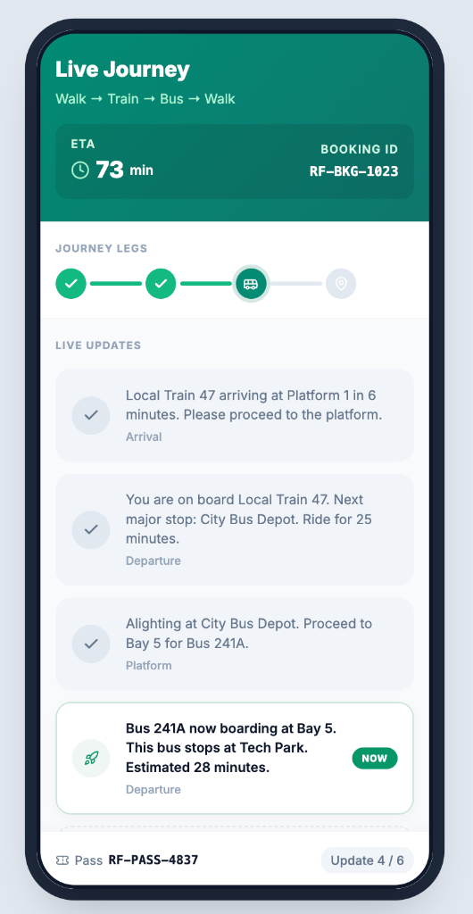
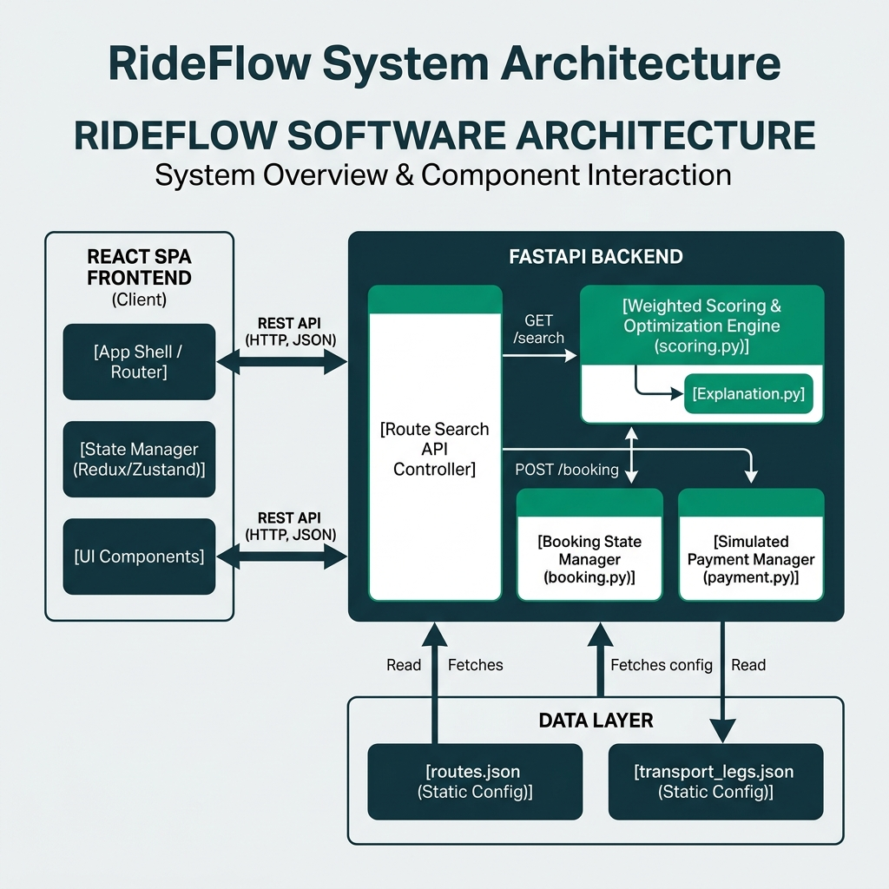

<div align="center">
  <h3>Intelligent Multi-Modal Journey Planner for Indian Urban Commuters</h3>
  <p>🏆 <i>Hackathon MVP Submission — Optimized for Functionality, Technical Depth, Innovation, Usability, and Real-World Scalability.</i></p>
  
  [](https://vite.dev/)
  [](https://fastapi.tiangolo.com/)
  [](https://tailwindcss.com/)
  [](LICENSE)
</div>

---

## 📽️ Demo Video
📺 **[Watch the 3-5 Minute Video Demo Here](https://youtu.be/G32DoH6ffR8)**

---

## 📌 Problem Statement
Urban commuters in Indian metro cities (e.g., Mumbai, Delhi, Bengaluru) face a highly fragmented public transit network. Traveling from point A to point B often requires shifting between local trains, metros, city buses, auto-rickshaws, and walking. 
* **Fragmentation:** Commuters must manage multiple apps to plan routes, purchase separate physical/digital tickets for each leg of the journey, and coordinate timing amidst unpredictable delays.
* **Friction:** Lack of centralized payment standards (like unified NCMC cards across private and public sectors) and a single source of truth for dynamic delays increases commute stress.

---

## 💡 Key Innovation & Usability
RideFlow reimagines the Indian daily commute by targeting usability friction points with high-impact product design:

* **Unified Transit Ticketing (NCMC Simulation):** Leverages India's **National Common Mobility Card (NCMC)** standard. Instead of multiple payments, users transact once from their NCMC wallet to purchase an entire multi-modal journey.
* **The Single QR Pass Concept:** Solves ticket fragmentation. The app aggregates metro, local rail, and bus tickets, embedding them into a single, unified digital "Journey Pass" (a single QR code). 
* **Premium Usability & Aesthetics:** Built using a mobile-first app-shell frame designed for native performance. Crafted with a premium dark and green color scheme, featuring custom scrollbars, clean card drop-shadows, and micro-interactions designed to elevate the user experience.
* **Simulated Real-Time Commuter Guidance:** Explains platform transfers and live updates in a unified timeline. Rather than generic messages, the timeline injects actual booking ticket IDs and live ETA tracking for each leg.

---

## 📱 Interactive User Journey Walkthrough

Here is the end-to-end user workflow diagram illustrating the multi-modal transit planning, ticketing, and live guidance process:

<div align="center">
  
</div>

---

### 1. Smart Route Planner
Enter origin and destination. Select custom routing preferences (Balanced, Fastest, Cheapest, Least Walking, Fewest Transfers, Eco-Friendly) and view available modes in the area.

<div align="center">
  
</div>

---

### 2. Multi-Modal Options & Custom Scoring
Compare structured transit combinations displaying transfers, carbon footprint labels, safety indicators, reliability metrics, and price points. The backend ranking engine re-orders these routes dynamically based on your chosen preference.

<div align="center">
  
</div>

---

### 3. Granular Step-by-Step Breakdown & Explainability
Review step-by-step navigation directions including exact platform numbers, bus bay IDs, and timing schedules. Read the AI-generated **"Why this route?"** card which highlights the pros and cons of the selected option compared to other transit pairs.

<div align="center">
  
</div>

---

### 4. Unified Booking & Digital Journey Pass
Deduct the total fare from the integrated National Common Mobility Card (NCMC) Wallet. Instantly receive a **single unified Journey Pass QR code** containing individual sub-ticket IDs for each transit leg (e.g. Train local ticket, Bus boarding ticket).

<div align="center">
  
</div>

---

### 5. Live Journey Tracking
Active tracking updates keep you notified of incoming arrivals, departure statuses, platform assignments, and delays, giving commuters real-time confidence on every leg of their journey.

<div align="center">
  
</div>

---

## 🧠 Technical Depth & Backend Architecture

RideFlow follows a decoupled client-server architecture featuring a React Single Page Application (SPA) communicating via REST APIs with a FastAPI server:

<div align="center">
  
</div>

### 1. Multi-Criteria Scoring & Optimization Engine
To handle diverse transit options, the system implements a normalized multi-criteria routing algorithm (`app/services/scoring.py`). Since metrics like time (minutes), fare (rupees), and walk distance (meters) have different units, the engine first normalizes values into $[0, 1]$ relative ranges:
$$\text{Normalized Value} = \frac{x - x_{min}}{x_{max} - x_{min}}$$

The engine then computes a weighted score for each route using preference weight profiles defined in the system:
$$\text{Score} = (W_{time} \times \text{NormTime}) + (W_{fare} \times \text{NormFare}) + (W_{transfers} \times \text{NormTransfers}) + (W_{walking} \times \text{NormWalking}) + \text{Penalties}$$

#### Preference Weights Matrix
| Preference Profile | Time ($W_t$) | Fare ($W_f$) | Transfers ($W_{tr}$) | Walking ($W_w$) | Reliability ($W_r$) | Carbon ($W_c$) | Safety ($W_s$) |
| :--- | :---: | :---: | :---: | :---: | :---: | :---: | :---: |
| **Balanced** | 0.25 | 0.20 | 0.15 | 0.15 | 0.10 | 0.10 | 0.05 |
| **Fastest** | 0.50 | 0.10 | 0.15 | 0.10 | 0.10 | 0.03 | 0.02 |
| **Cheapest** | 0.10 | 0.55 | 0.10 | 0.10 | 0.08 | 0.05 | 0.02 |
| **Least Walking** | 0.15 | 0.15 | 0.15 | 0.45 | 0.05 | 0.03 | 0.02 |
| **Fewest Transfers** | 0.15 | 0.15 | 0.50 | 0.10 | 0.05 | 0.03 | 0.02 |
| **Eco-Friendly** | 0.15 | 0.10 | 0.10 | 0.10 | 0.05 | 0.45 | 0.05 |

* **Penalties:** The engine applies additive penalties to routes using unreliable, high-carbon, or low-safety transits:
  - **Reliability Penalty:** Low Reliability = $+0.15$; Medium = $+0.05$; High = $0.00$.
  - **Carbon Penalty:** High Carbon = $+0.12$; Medium = $+0.05$; Low = $0.00$.
  - **Safety Penalty:** Low Safety = $+0.10$; Medium = $+0.04$; High = $0.00$.

### 2. Rule-Based Route Explainability Engine
The `explanation.py` engine generates natural language comparisons by computing the relative rank of the selected route across the search pool:
* If the user selects a slower but cheaper route, the engine dynamically calculates the difference and outputs: *"It is 12 min slower than the fastest route but saves ₹28 in fare."*
* If walking exceeds limits, it appends warning flags: *"Note: This route involves 1,200m of walking."*

### 3. Transactional Ticketing State Engine
The booking controller (`app/routes/booking.py`) manages multi-modal ticketing states. For each non-walk transit leg (bus, train, metro, auto), the engine creates unique, vendor-formatted ticket identifiers (e.g., `BUS-RF-7095` or `MTR-RF-1294`). These are tied together under a parent `bookingId` until payment transition.

---

## 📈 Real-World Applicability & Scalability

While the MVP demonstrates the concept using a fast, mock in-memory layer, the architecture has been designed to scale directly into production.

### 1. Data Standardization (GTFS)
The JSON transit data structure in `backend/data/` mirrors standard **GTFS (General Transit Feed Specification)** schemas. To scale to a new city, developers can import raw GTFS schedules from state transit corporations (like Delhi Metro DMRC or Mumbai local rail) directly into the routing node lists.

### 2. Upgrading the Routing Engine
* **MVP:** The MVP uses pre-calculated route definitions between key nodes.
* **Production Scale:** We can swap the static search with an open-source multi-modal graph engine like **OpenTripPlanner (OTP)** or **OSRM**. OTP supports multi-modal Dijkstra / A* route planning across GTFS rail schedules and OpenStreetMap (OSM) walk pathways out of the box.

```
[GTFS Feeds (Metro/Bus)] ──┐
                          ├──> [OpenTripPlanner Engine] ──> [RideFlow Scoring Engine]
[OSM Walk Paths (Map)] ───┘
```

### 3. Production Database & Transaction Security
* **Production Database:** Transition the in-memory backend states to **PostgreSQL** (for ACID transactions on bookings and wallet balances) and **Redis** (for fast caching of routing queries and live journey feeds).
* **Payment Integration:** Integrate standard UPI/Razorpay SDKs alongside standard bank NCMC interface protocols (ISO 8583 standards) to handle actual card deductions.
* **State Operations:** Secure wallet updates using database-level locking (`SELECT FOR UPDATE`) or transactional queues to prevent double-spending and race conditions.

---

## 🛠️ Installation & Running Locally

### 1. Prerequisites
Ensure you have the following installed:
* **Node.js** (v18 or higher)
* **Python** (v3.9 or higher)

### 2. Run the Backend (FastAPI)
1. Open your terminal and navigate to the backend directory:
   ```bash
   cd backend
   ```
2. Create a virtual environment and activate it:
   ```bash
   python -m venv .venv
   # On macOS/Linux:
   source .venv/bin/activate
   # On Windows:
   .venv\Scripts\activate
   ```
3. Install dependencies:
   ```bash
   pip install -r requirements.txt
   ```
4. Start the FastAPI development server:
   ```bash
   uvicorn app.main:app --reload --port 8000
   ```
   *The API will run locally at `http://localhost:8000`.*

### 3. Run the Frontend (React + Vite)
1. Open a new terminal window and navigate to the frontend directory:
   ```bash
   cd frontend
   ```
2. Install the Node modules:
   ```bash
   npm install
   ```
3. Start the development server:
   ```bash
   npm run dev
   ```
   *Open your browser and navigate to the Vite port specified in the terminal (usually `http://localhost:3000` or `http://localhost:5173`).*

---

## ⚙️ API Endpoints Summary

| Method | Endpoint | Description |
| :--- | :--- | :--- |
| `GET` | `/locations` | Fetch all available transit nodes/locations |
| `GET` | `/routes/pairs` | Fetch all valid source/destination pairs |
| `POST` | `/routes/search` | Compute and return preference-ranked multi-modal routes |
| `GET` | `/routes/{routeId}` | Fetch step-by-step breakdown of a route |
| `GET` | `/routes/{routeId}/explanation` | Fetch relative trade-off justification logic |
| `POST` | `/bookings/create` | Set up ticket structures for each transit leg |
| `POST` | `/payments/pay` | Deduct simulated balance and issue Journey Pass |
| `GET` | `/journey/{bookingId}/updates` | Fetch chronological live-transit tracking sequence |
| `GET` | `/wallet/balance` | Fetch mock NCMC wallet balance |
| `POST` | `/wallet/add` | Add simulated funds to NCMC balance |

---

## ⚖️ Hackathon MVP Scope: Real vs. Simulated
* **Real Elements:** Multi-criteria routing optimization engine, AI-style explainability algorithm, booking state machine, React state architecture, HTTP API client-server communication, and Tailwind CSS app shell layout.
* **Simulated Elements:** Database persistence (in-memory mock structures), live GPS tracks (simulated progression interval), and actual payment gateway (simulated balance deduction).

---

## 📄 License
Distributed under the MIT License. See `LICENSE` for more information.
